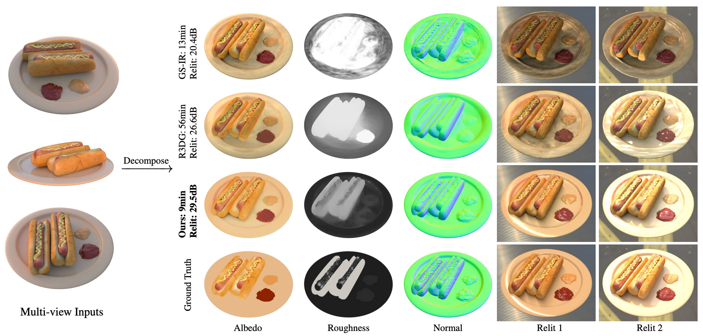
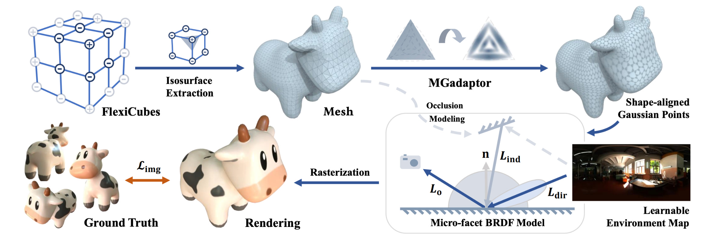

# GeoSplatting: Towards Geometry Guided Gaussian Splatting for Physically-based Inverse Rendering (ICCV 2025)

#### [Project Page](https://pku-vcl-geometry.github.io/GeoSplatting/) | [arXiv Paper](http://arxiv.org/abs/2410.24204)

[Kai Ye](https://illusive-chase.github.io/)\*, [Chong Gao](https://timchonggao.github.io/ChongGao.github.io/)\*, [Guanbin Li](http://guanbinli.com), [Wenzheng Chen](https://wenzhengchen.github.io/)†, [Baoquan Chen](https://baoquanchen.info/)†


Welcome to the official repository for GeoSplatting! This project introduces a novel approach to inverse rendering that leverages the power of 3D Gaussian Splatting, guided by explicit geometry, to achieve state-of-the-art results in physically-based material and lighting estimation from images. By integrating a surface-based representation with the efficiency of Gaussian splats, GeoSplatting offers a robust framework for decomposing scenes into their fundamental components: geometry, materials, and lighting.




## 🚀 Getting Started

Follow these steps to set up the environment and prepare the necessary datasets for running GeoSplatting.

### 1. Environment Setup

First, clone the repository and set up the conda environment.

```shell
git clone -b main --single-branch https://github.com/PKU-VCL-Geometry/GeoSplatting.git
cd GeoSplatting
conda create --name geosplatting -y python=3.10
conda activate geosplatting
pip install --upgrade pip setuptools
```
Next, install the required Python packages.
```shell
# Install PyTorch
pip install numpy==1.26.4
pip install torch==2.1.2 torchvision==0.16.2
# Verify CUDA is working correctly
python -c "import torch; torch.zeros(1).cuda()" || echo "ERROR: CUDA check failed"
# Install remaining dependencies
pip install git+https://github.com/NVlabs/nvdiffrast/
pip install --global-option="--no-networks" git+https://github.com/NVlabs/tiny-cuda-nn#subdirectory=bindings/torch
pip install -e .
```

### 2. Data Preparation

You'll need to download and organize the datasets to replicate the paper's experiments.

#### Synthetic4Relight Dataset

Download the [Synthetic4Relight Dataset](https://drive.google.com/file/d/1wWWu7EaOxtVq8QNalgs6kDqsiAm7xsRh/view?usp=sharing) provided by [InvRender](https://github.com/zju3dv/InvRender).
Download the [GT relighting environment maps](https://github.com/zju3dv/InvRender/tree/main/code/envmaps) for the Synthetic4Relight Dataset ( `envmap*.exr` ).
Organize the dataset as follows:
```
GeoSplatting/
 ├─ data/
 │   ├─ Synthetic4Relight/
 │   │   ├─ air_baloons/
 │   │   │   ├─ test/
 │   │   │   ├─ test_rli/
 │   │   │   ├─ train/
 │   │   │   ├─ transforms_test.json
 │   │   │   └─ transforms_train.json
 │   │   ├─ chair/
 │   │   │   └─ ...
 │   │   ├─ hotdog/
 │   │   │   └─ ...
 │   │   ├─ jugs/
 │   │   │   └─ ...
 │   │   ├─ envmap3.exr
 │   │   ├─ envmap6.exr
 │   │   └─ envmap12.exr
 │   └─ ...
 ├─ rfstudio/
 │   └─ ...
 ├─ README.md
 └─ ...
```
#### TensorIR Synthetic Dataset
Download the [TensoIR Synthetic Dataset](https://zenodo.org/record/7880113#.ZE68FHZBz18) provided by [TensoIR](https://github.com/Haian-Jin/TensoIR).
Download the [GT relighting environment maps](https://drive.google.com/file/d/10WLc4zk2idf4xGb6nPL43OXTTHvAXSR3/view?usp=share_link) for the TensorIR Synthetic Dataset.
Organize the dataset as follows:
```
GeoSplatting/
 ├─ data/
 │   ├─ tensoir/
 │   │   ├─ armadillo/
 │   │   │   ├─ test_000/
 │   │   │   ├─ test_001/
 │   │   │   ├─ ...
 │   │   │   ├─ train_000/
 │   │   │   ├─ train_001/
 │   │   │   └─ ...
 │   │   ├─ ficus/
 │   │   │   └─ ...
 │   │   ├─ hotdog/
 │   │   │   └─ ...
 │   │   ├─ lego/
 │   │   │   └─ ...
 │   │   ├─ bridge.hdr
 │   │   ├─ city.hdr
 │   │   ├─ fireplace.hdr
 │   │   ├─ forest.hdr
 │   │   ├─ night.hdr
 │   │   └─ ...
 │   └─ ...
 ├─ rfstudio/
 │   └─ ...
 ├─ README.md
 └─ ...
```
#### Shiny Blender Dataset
Download the [Shiny Blender Dataset](https://storage.googleapis.com/gresearch/refraw360/ref.zip) provided by [Ref-NeRF](https://dorverbin.github.io/refnerf/).
Organize the dataset as follows:
```
GeoSplatting/
 ├─ data/
 │   ├─ refnerf/
 │   │   ├─ ball/
 │   │   │   ├─ test/
 │   │   │   ├─ train/
 │   │   │   ├─ trainsforms_test.json
 │   │   │   └─ trainsforms_train.json
 │   │   ├─ car/
 │   │   │   └─ ...
 │   │   ├─ coffee/
 │   │   │   └─ ...
 │   │   ├─ helmet/
 │   │   │   └─ ...
 │   │   ├─ teapot/
 │   │   │   └─ ...
 │   │   └─ toaster/
 │   │       └─ ...
 │   └─ ...
 ├─ rfstudio/
 │   └─ ...
 ├─ README.md
 └─ ...
```

### Training & Evaluation

To reproduce the quantitative comparisons from the paper, you can use the provided evaluation scripts.

+ Synthetic4Relight: `bash eval_s4r.sh` .
+ TensoIR Synthetic: `bash eval_tsir.sh` .
+ Shiny Blender: `bash eval_sb.sh` .

## ✨ Advanced Usage

### Inverse Rendering with Initial Mesh

You can optimize GeoSplatting using a pre-existing mesh as a starting point. This can improve geometry quality by avoiding the resolution limits of FlexiCubes, though it may impact performance on highly reflective surfaces. For implementation details, please see `tests/model/test_geosplat_prior.py` .
+ **For object-level scenes**, we recommend generating the initial mesh using the first stage of [MIRRES](https://github.com/brabbitdousha/MIRReS-ReSTIR_Nerf_mesh) where NeuS2 is used.
+ **For unbounded scenes**, we suggest using [GOF](https://github.com/autonomousvision/gaussian-opacity-fields) and then manually post-processing the mesh (e.g., cropping and simplifying).


### Direct Incorporation of MGAdaptor

For direct incorporation of MGAdaptor, please refer to `rfstudio/model/geosplat.py` at Line 379. This code is designed to be modular and can be adapted for your specific needs.

## 📖 Citation

If you find GeoSplatting useful in your research, please consider citing our paper.

```bibtex
@inproceedings{ye2025geosplatting,
  title={Geosplatting: Towards geometry guided gaussian splatting for physically-based inverse rendering},
  author={Ye, Kai and Gao, Chong and Li, Guanbin and Chen, Wenzheng and Chen, Baoquan},
  booktitle={Proceedings of the IEEE/CVF International Conference on Computer Vision},
  pages={28991--29000},
  year={2025}
}
```

## 🎉 Acknowledgments & Codebase

This official implementation is developed from the internal codebase of the [Visual Computing and Learning Lab](https://vcl.pku.edu.cn/). While the core GeoSplatting code has been carefully verified, other parts of the repository are under active development and may contain temporary limitations. We plan to release a fully polished codebase in the future.

Our work stands on the shoulders of giants. We are incredibly grateful to the authors of these amazing open-source projects:

  + [tyro](https://github.com/brentyi/tyro): zero-effort CLI interfaces & config objects, from types.
  + [nvdiffrast](https://github.com/NVlabs/nvdiffrast): modular primitives for high-performance differentiable rendering.
  + [nvdiffrec](https://github.com/NVlabs/nvdiffrec): official code for the CVPR 2022 (oral) paper "Extracting Triangular 3D Models, Materials, and Lighting From Images".
  + [nvdiffrecmc](https://github.com/NVlabs/nvdiffrecmc): official code for the NeurIPS 2022 paper "Shape, Light, and Material Decomposition from Images using Monte Carlo Rendering and Denoising".
  + [tiny-cuda-nn](https://github.com/NVlabs/tiny-cuda-nn): lightning fast C++/CUDA neural network framework.
  + [nerfacc](https://github.com/KAIR-BAIR/nerfacc): a general NeRF acceleration toolbox in PyTorch.
  + [nerfstudio](https://github.com/nerfstudio-project/nerfstudio/): a collaboration friendly studio for NeRFs.
  + [gsplat](https://github.com/nerfstudio-project/gsplat): CUDA accelerated rasterization of gaussian splatting.
  + [viser](https://github.com/nerfstudio-project/viser): web-based 3D visualization + Python.
  + [rich](https://github.com/Textualize/rich): a Python library for rich text and beautiful formatting in the terminal.
  + [gsplat.js](https://github.com/huggingface/gsplat.js): a JavaScript Gaussian Splatting library.
